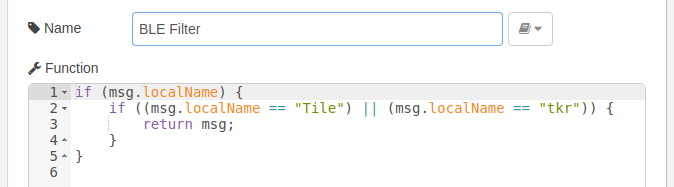
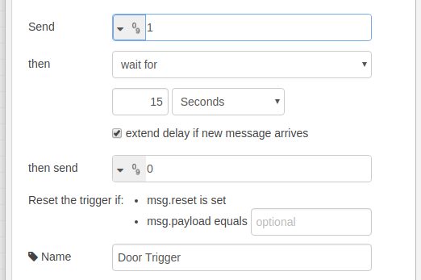

# Raspberry Pi 3 Automated Pet Door

## The Project

The goal of this project is to build an IoT style motorized pet door so we can control which animals can come into the house. For this we are using BLE tags attached to the animals (cats) and the built-in Bluetooth module on the Raspberry Pi 3 which scans for the tags. We also have some indicator LEDs on the Raspberry Pi 3 for troubleshooting what state the door is supposed to be in.

The Node-RED BLE Scan node continuously scans for BLE advertisements. If it sees one that matches the device name and minimum RSSI it will open the pet door, and after a timeout period it will close the door. In order to prevent the door from closing prematurely on a slow-moving animal, the system will reset the timer whenever it gets a BLE match.

This project has a couple different areas to it: the hardware, which is all the wiring and components necessary for manipulating the door, and the software which is all the logic for deciding which direction the door should move.

## The Hardware

The opening and closing of the door is done by a 12 VDC motorized automotive antenna, mounted upside-down above the door, with the end of the antenna attached to the door itself. These will come with a circuit in them which can probably be reverse-engineered to control the antenna, but we're not doing that here so you'll want to rip the circuit out and use the motor wires directly.

To drive the antenna motor you will most likely need a 12V power supply that's at least 1 amp. I used an old D-Link router power supply I had laying around:

You'll need to mount two limit switches on the door to stop the motor on either end. I used magnetic switches because it's what I had on-hand, but a standard switch with a lever arm would work better.

Assemble the H-Bridge Pi Hat according to the image below, paying close attention to the direction of the diodes; this is the limiting circuit. The H-Bridge used is two-channel but we're only using one for now. The motor, switches and 12 VDC in will get connected to the Pi Hat as shown in the image.

Assemble the LED Pi Hat according to the image below. Blue LEDs require a little more current than the Pi's can reliably provide via GPIO, so we're powering all the LEDs from the 5 V line and using transistors connected to the GPIOs to toggle them.

## The Software
The software for this project is just Node-RED running on a standard Raspbian installation. Most of the logic is handled using standard nodes that come with the RPi version of node-red with the exception of the BLE scanner, which requires the "scan ble" node from node-red-contrib-noble. 

Follow the instructions from the following links to setup the components:

- [Install Raspbian](https://www.raspberrypi.org/downloads/raspbian/)
- [Install Node-RED](https://nodered.org/docs/hardware/raspberrypi)
- [Install node-red-contrib-noble](https://flows.nodered.org/node/node-red-contrib-noble)

Once everything is installed and working, you will configure your Node-RED flow to look something like this:

Our entry point for the flow is the "scan ble" node; make sure to check the box to allow duplicates.

After that add a "function" node to filter BLE advertisements based on the "local name" property; I used Tile Tracker tags which use "Tile" as the local name.

Next is a "switch" node for checking the RSSI of the advertisement. You'll need to tweak this setting to match the tags and the distance to open the door.

Then you can add another "switch" node to filter tags based on their unique ID so it doesn't trigger on other tags that are near the door. If you don't already know the unique ID you can use a debug node on the "scan ble" node to see the advertisements and experiment to see which one is yours. Set the first rule to match a null UUID and don't connect the output; this will filter out some junk. Add an additional rule for each UUID.

Add a "change" node for each of the rules you added in the previous node and give it a unique "trigger source" value. These nodes are not required but they will give you the ability to do additional filtering per tag in the future; I used my the cat's name as the source.

Next we need to tell the rest of the flow that we want to trigger the door to open by changing the message payload to 1. Connect any open trigger sources to this node.

Now this trigger message will do two things: trigger the blue LED to flash for receiving a BLE packet, and trigger the door to open.

First setup the LED path by adding a "trigger" node. Set it to send a 1 and then after 500 millis send a 0. This will cause the LED to just flash once.

To that node connect a "rpi gpio" output node and configure it for the blue LED GPIO. Set it to initialize to the 0 (off) state.

Next is to configure the door trigger path. Go back to the trigger payload node and connect a "change" node with two outputs. One output will route to the open path with a "1" payload, the other will route to the close path with a "0" payload.

Both of those outputs will connect to the same node, but the open connection has an additional trigger node in the path to trigger a close after a timeout. Add a "trigger" node to send a "1" and then after a timeout (15 seconds) send a "0".

Then connect that trigger node and the second output from the previous node to a "function" node. This function node has two outputs that connect to the open GPIO nodes and the close GPIO nodes. Since you don't want the door both open and closed at the same time, it will send opposite values to each output. So if the trigger payload is "1" for open, it will send "1" to the open GPIOs and "0" to the close GPIOs and if the payload is "0" for close it will send "0" to the open GPIOS and "1" to the close GPIOs.

Finally, for each output connect a GPIO node for the LED and a GPIO node for the H-Bridge:

Green LED:

H-Bridge Up:

Red LED:

H-Bridge Down:

Additionally you should add an "inject" node to automatically a "1" payload to open the door on startup, that way the flow knows which state the door is in. I also added some manual inject nodes for opening and closing the door through the Node-RED interface.

The initialization injection node looks like this:

That should do it for the Node-RED flow!
